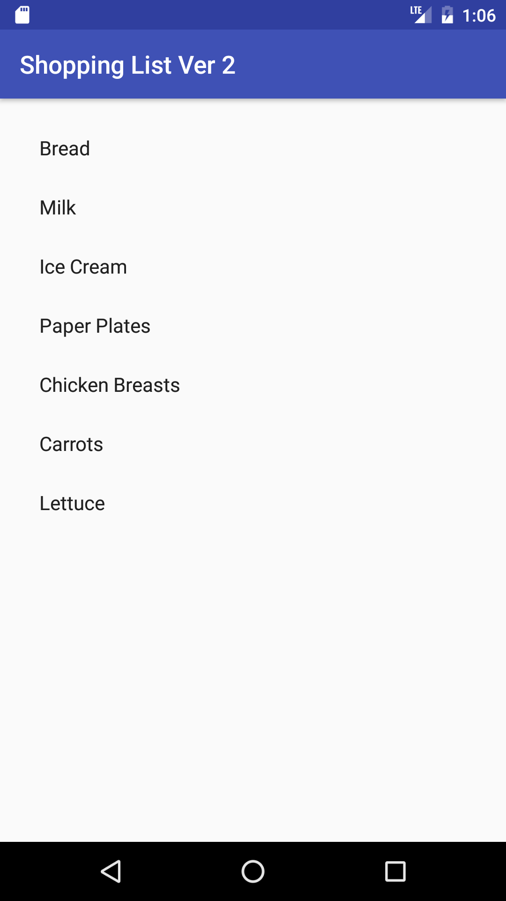
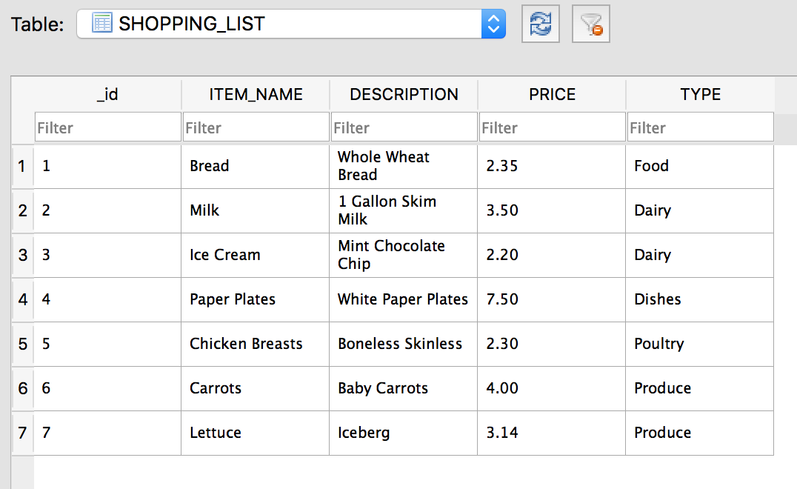

#  Databases and RecyclerView - Grocery List

## Introduction

> ***Note:*** _This can be a pair programming activity or done independently._

In this lab, you will be displaying a list of grocery items from a SQLite database using a `RecyclerView`. Each grocery item has a name, description, price, and type. On this screen, you will only be showing the name of each item.

See the screenshot below for the column names of the table in the database.

## Exercise

#### Requirements

- Extend and complete the SQLiteOpenHelper class to query the database for all of the grocery items
- Make a RecyclerView (with all required components) to display the names of the grocery items

**Bonus:**
- Create a custom layout for the ListView item to show more info from the database

#### Starter code

The `starter-code` folder contains an Android project with the following:

- A MainActivity.java file that pre-populates the database

#### Deliverable

The screenshot below shows what the app should look like.

## Additional Resources

- [Cursor](http://developer.android.com/reference/android/database/Cursor.html)
